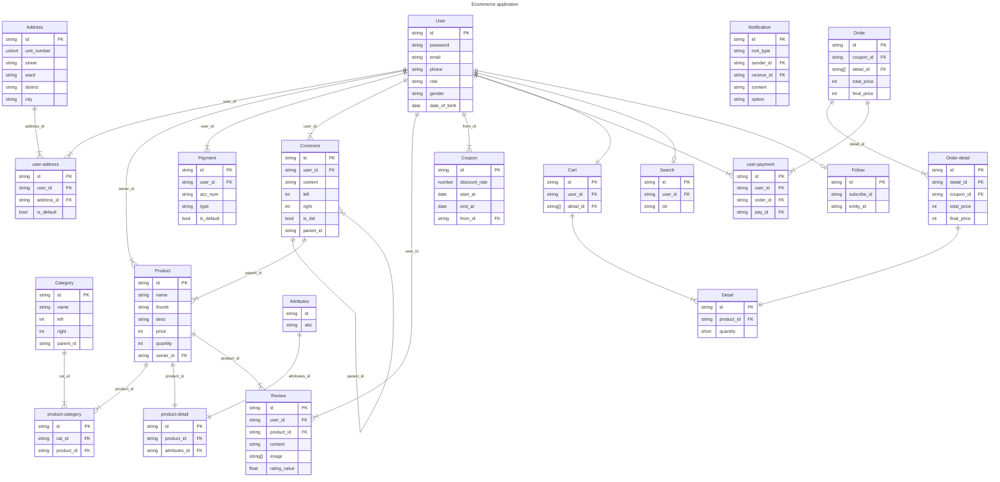
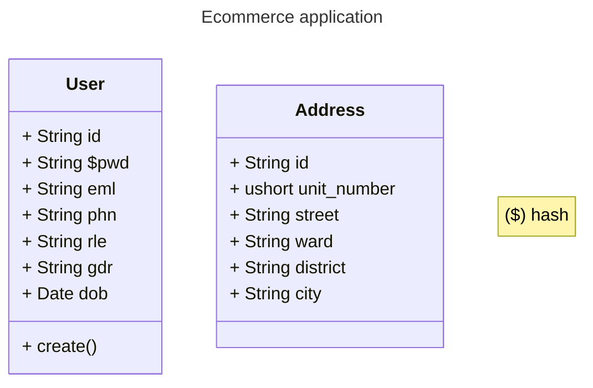

# Ecommerce application backend

## Design database

### Entity Relationship Diagrams (ERDs)

#### Note

parent_id --> parent_id

### Class Diagram

## Overview

Nested set model for:

[x] Category

[x] Comment

Connect database use Singleton Pattern.

Polymorphic Pattern for product attributes.
